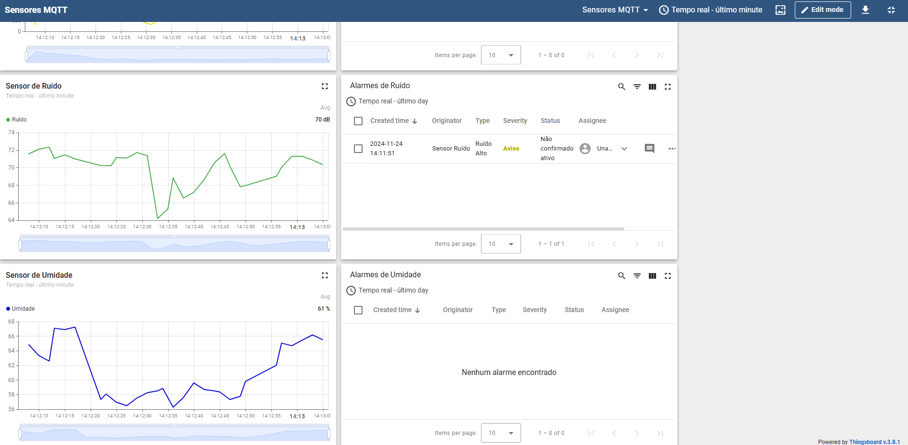

# Simulação de Monitoramento MQTT

O objetivo deste trabalho é criar e apresentar um ambiente de Internet das Coisas (IoT) distribuído por meio de um vídeo tutorial. Neste ambiente, dispositivos físicos ou virtuais enviarão dados de sensoriamento, que podem ser simulados ou reais, para uma aplicação em nuvem. A aplicação em nuvem receberá, armazenará, processará e exibirá os dados coletados por meio de um dashboard.



## Instalação do ambiente

1. Clonar o repositório do projeto

```bash
git clone https://github.com/matregnago/mqtt-simulation.git
```

2. Criar um ambiente virtual e instalar as bibliotecas

```bash
python -m venv .venv
pip install paho-mqtt pandas numpy python-dotenv
```

3. Baixar o csv dos dados (apenas com e-mail `ucs.br`) a partir desse **[link](https://drive.google.com/file/d/1fHNFkI0NOL7wWDTvnyyGX58vQLxx_49x/view?usp=sharing)**
4. Instalar o **[Docker](https://www.docker.com/)**
5. Subir o container do ThingsBoard

```bash
cd thingsboard
docker compose up -d
```

6. Logar no ThingsBoard e criar 4 dispositivos.
7. Criar arquivo `.env` a partir do exemplo `.env.example`

```bash
cp .env.example .env
```

8. Preencher as variáveis de ambiente com os tokens dos dispositivos
9. Rodar o projeto com `py`, `python` ou `python3`

```bash
py generate_values.py
```

10. (Opcional) Importação dos alertas

- Caso queira importar as regras de alertas, é preciso importar os arquivos `json` da pasta `alertas`do projeto para dentro do ThingsBoard

### Links adicionais

- **[Documentação ThingsBoard](https://thingsboard.io/docs/#:~:text=ThingsBoard%20Community%20Edition)**
- **[Paho MQTT](https://pypi.org/project/python-dotenv/)**
- **[Projeto IOT que serviu de inspiração (City Living Lab)](https://www.citylivinglab.com/iot-inova-rs)**
